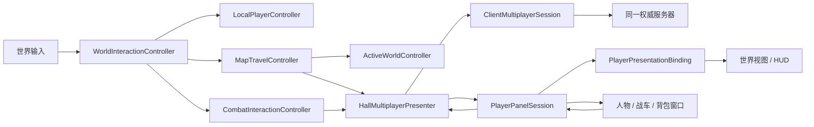

# 客户端结构与阅读顺序

2026-09-14 客户端重构。规范见 [工程规范](engineering_standards.md)。
本页描述实际代码，不是规划目录。`main_hall.gd` 从 1438 行缩减为 251 行，没有保留旧业务转发方法。

## 先从这里读

| 模块 | 所有权与公开入口 |
| --- | --- |
| [main_hall](../scripts/main_hall.gd) | 启动参数、依赖创建和信号连接；每帧调用唯一移动控制器 |
| [WorldInteractionController](../scripts/client/gameplay/world_interaction_controller.gd) | 键鼠分发、NPC/设施选择、多出口菜单；`move_to`、`show_npc_popup` |
| [MapTravelController](../scripts/client/gameplay/map_travel_controller.gd) | 切图请求、待提交资源、权威确认、首次加载遮罩、失败冻结 |
| [CombatInteractionController](../scripts/client/gameplay/combat_interaction_controller.gd) | 射击/采矿/拾取意图、战斗快照分发、维修和击毁救援；不结算伤害 |
| [LocalPlayerController](../scripts/client/gameplay/local_player_controller.gd) | 目标、路径、方向、预测序号和玩家位置的唯一写入者 |
| [ActiveWorldController](../scripts/client/world/active_world_controller.gd) | 活动地图定义、导航、实体和地图 HUD 的原子替换 |
| [ClientWorldView](../scripts/client/presentation/client_world_view.gd) | 世界渲染节点的创建和释放；玩家锚点、镜头、怪物/矿物/掉落视图及特效 |
| [PlayerPresentationBinding](../scripts/client/presentation/player_presentation_binding.gd) | 同一玩家投影到服装、战车、HUD 主装置、移动许可和相机；不写角色位置 |
| [HallMultiplayerPresenter](../scripts/client/presentation/hall_multiplayer_presenter.gd) | 会话到表现层的信号适配，网络提示只发业务信号 |
| [PlayerPanelSession](../scripts/client/state/player_panel_session.gd) | 独立于窗口的 CurrentPlayer 生命周期、同事务快照和命令 revision 补齐 |
| [GameWindowManager](../scripts/client/ui/windows/game_window_manager.gd) | 窗口创建、显示、关闭、置顶、边界约束，以及快照到各窗口的分发 |

渲染节点集合 `ClientWorldView` 不保存会话、切图请求、窗口或玩家领域状态。各控制器显式接收所需依赖；没有主场景引用、全局服务字典或通过父节点查找业务对象。

## 数据和事件方向



启动时先创建世界和 HUD，再连接玩家投影、窗口、战斗和切图订阅者，最后启动会话。这样进程内传输同步返回快照时，订阅者已经就绪。服务器的物理时钟、保存和延迟释放协议没有改动。

切图仍按“预载 → 权威确认 → 原子提交”执行。确认前失败可恢复旧地图；确认后无法呈现目标地图必须锁住输入并断开会话。测试直接访问该状态的所有者，不再经过入口兼容属性。

2026-09-17 移动开炮修复：`LocalPlayerController` 从已校验的实体快照消费可用移速，并在
单帧跨拐点时保留剩余移动距离，防止长距离寻路中客户端与权威位置持续漂移。确认开火时，
表现控制器用当前可见车身脚点加上权威炮口相对偏移创建特效，不回写车身历史位置；弹道
终点与最终命中仍属于服务端。协议细节见[移动契约](technical_architecture.md#61-核心消息)，
验收见[移动开炮诊断](combat_diagnostics.md#2026-09-17-移动途中开炮的坐标同步)。

## 复用展示组件

- [EquipmentLayerView](../scripts/client/ui/components/equipment_layer_view.gd)：人物和战车共同使用的装备图层，统一图片解析、ALE 原点、锚点、固定槽位和悬浮说明。人物槽位与战车 Location 的命令含义仍由各面板负责。
- [InventoryCanvas](../scripts/client/ui/components/inventory_canvas.gd)：可以独立加入任意 Control 的像素背包区域。接收 `Inventory`，发出移动和装备意图；不修改物品、不维护网络版本、不要求窗口管理器存在。
- [DraggableGameWindow](../scripts/client/ui/windows/draggable_game_window.gd)：继续承担共同的窗口壳行为。各业务窗口保留布局与操作语义，避免构造一个包含所有窗口分支的通用面板。
- [PlayerPanelProjector](../scripts/shared/player_panel_projector.gd)：客户端和服务端共用的纯投影器，从 server 目录移到 shared；领域计算没有改变。

HUD 外部使用 `show_status`、`show_network_notice`、`selected_action`、`select_action`、`add_overlay` 和既有地图/系统消息 API。内部控件只在 HUD 自身及验证其布局的测试中访问。

新窗口订阅已有 `PlayerPanelSession`；构造时立即显示当前快照。关闭或销毁窗口不会销毁玩家投影。`CurrentPlayer.apply_bundle` 的深层非法输入原子性仍属于后续状态边界工作，不把这次生命周期拆分描述为已经解决。

## 可复现检查

首次检出工程后先用 Godot 完成资源和全局脚本类导入；原有总门禁包含该步骤。

```powershell
python -X utf8 tools/check_client_architecture.py
python -X utf8 tools/run_client_checks.py --godot C:/Users/tomato/Downloads/Godot_v4.7.2-stable_win64_console.exe
```

客户端检查包含 23 个运行测试及入口零警告扫描，每个子进程最多运行 120 秒；退出码为零但出现脚本错误也判失败。完整日志和 `summary.json` 写到 `.godot/client-checks-*`。架构门禁和新增组件测试也已加入原有 `run_project_checks.ps1`。

视觉复现：运行 `tests/ui/runtime/reusable_player_ui_test.gd` 时使用图形渲染并传入 `-- --capture-components`，截图写入 `.godot/refactor-player-panels.png`。该测试使用内存权威夹具，不读取日常玩家存档。

## 本轮验证与保留问题

集中客户端回归实跑 24/24 通过（23 个运行测试和入口零警告扫描）；架构门禁的 4 个反例测试通过。

- 组件独立使用、窗口销毁重建、命令版本副本、同一物品只读、网络提示恢复：16 项断言；图形模式另有截图保存断言。
- 人物/背包/战车 87 项，D04 438 项，连续切图 642 项，活动世界 112 项，旧地图存档恢复 10 项及客户端状态接缝 29 项均有本轮实际运行记录。
- 原有 `player_rich_model_test` 有 7 项失败；在隔离导出的重构前 `90e6857` 代码和数据上复现相同结果。涉及物品总数及高级底盘换装/派生属性，未修改断言或领域数据。
- 全仓函数注释检查仍有 77 项历史缺漏；重构模块的契约注释门禁单独通过。基线提交有 81 项，其中 4 项已被用户原有工作树修改补齐。
- 本轮未执行全部资源导入、所有 GPU 测试及独立 ENet 多进程套件；Windows 根证书读取会输出环境错误，未导致客户端回归失败。
- 地图 bundle 和旧面板 DTO 仍使用 Dictionary；服务器 facade、生产 SQLite、统一实体视图注册、全部窗口 `.tscn` 场景化均不是本次完成项。
